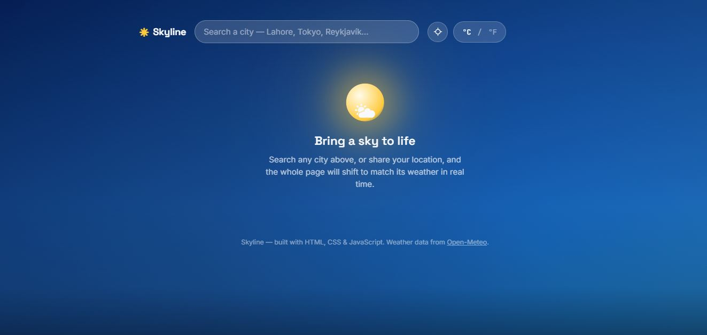
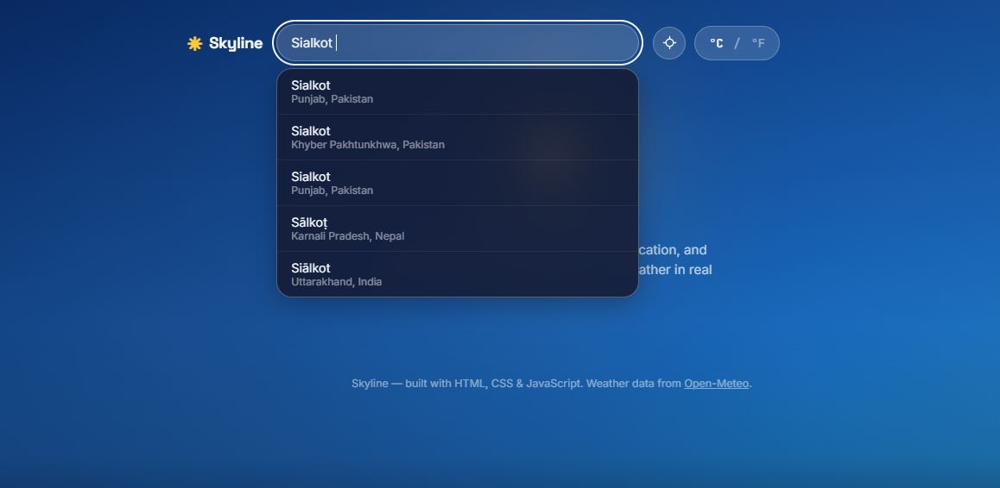
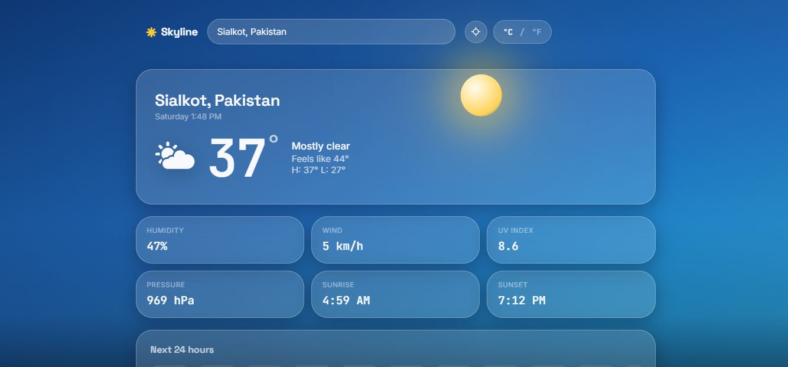
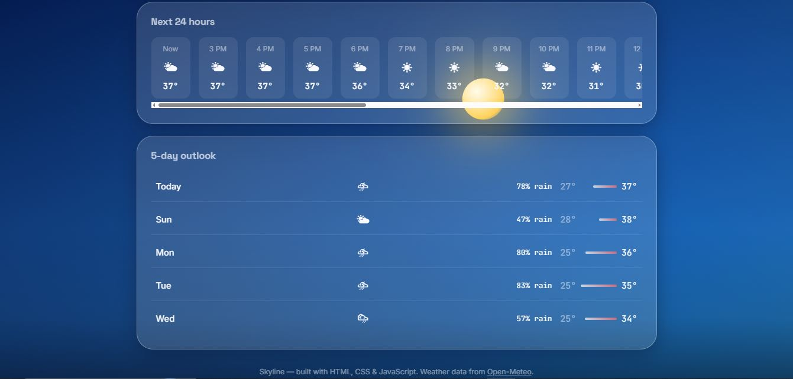

# 🌤 Skyline — Live Weather Dashboard

**The sky outside — rendered in real time.**

Skyline is a single-page weather dashboard where the background *is* the weather. Instead of a static UI with numbers on top, the entire page shifts in real time — colors, gradients, and mood — to match the actual sky of any city on Earth.

🔗 **Live Demo:** [ayeshacodes25.github.io/Skyline-Live-Weather-Dashboard](https://ayeshacodes25.github.io/Skyline-Live-Weather-Dashboard/)

---

## 📸 Screenshots

<p align="center">
  
  
</p>
<p align="center">
  
  
</p>

---

## ✨ Features

- **Living animated sky** — the page background dynamically reflects current conditions (clear, cloudy, rainy, etc.) instead of relying on static icons alone
- **City search** — look up live weather for any city in the world
- **Geolocation support** — share your location to instantly see your local sky
- **Unit toggle** — switch seamlessly between °C and °F
- **Detailed current conditions** — humidity, wind speed, UV index, pressure, sunrise, and sunset
- **Next 24 hours** — hourly forecast at a glance
- **5-day outlook** — plan ahead with an extended forecast
- **Graceful error handling** — clear feedback if a city can't be found or data fails to load
- **Fully responsive** — built to work smoothly across desktop and mobile

## 🛠 Built With

- **HTML5** — semantic structure
- **CSS3** — animated, weather-reactive backgrounds and responsive layout
- **JavaScript (Vanilla)** — API integration, DOM manipulation, and dynamic UI updates
- **[Open-Meteo API](https://open-meteo.com)** — free, real-time weather and forecast data

## 🚀 Getting Started

To run Skyline locally:

```bash
git clone https://github.com/AyeshaCodes25/Skyline-Live-Weather-Dashboard.git
cd Skyline-Live-Weather-Dashboard
```

Then simply open `index.html` in your browser — no build step, no dependencies, no API key required.

## 📌 Why I Built This

Most weather apps treat weather as data — a temperature, an icon, a percentage. Skyline treats it as an *experience*. The goal was to design an interface where the visual atmosphere of the page communicates the weather before you even read a single number, while still surfacing all the detailed metrics a weather-conscious user actually needs.

## 🔮 Roadmap

- Weather-based sound/ambient effects
- Hourly precipitation probability chart
- Saved/favorite cities
- Dark mode refinements for night-time conditions

## 👩‍💻 Author

**Ayesha Amjad** ([@AyeshaCodes25](https://github.com/AyeshaCodes25))
Front-End Developer & Digital Marketing Specialist


---

⭐ If you like this project, consider giving it a star on GitHub!
